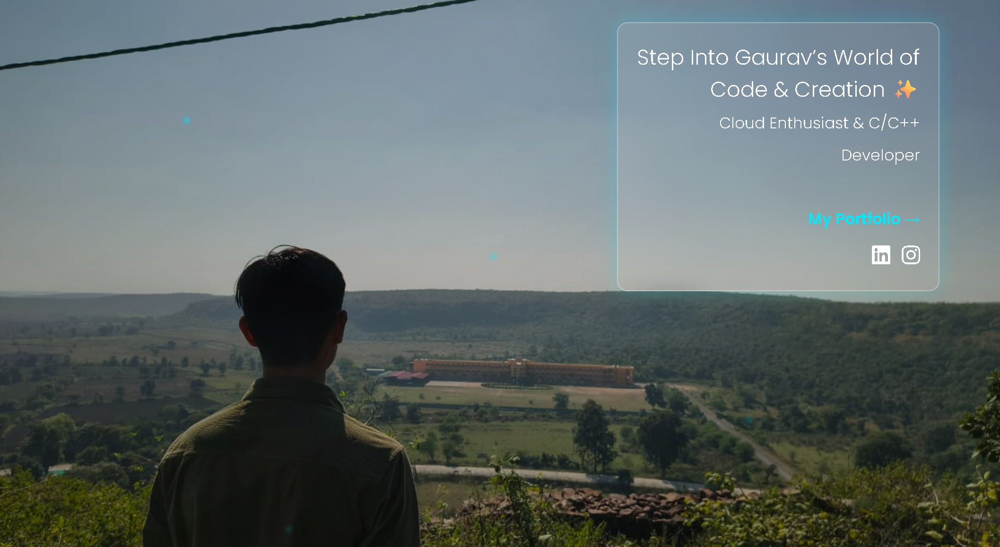

# 🚀 Personal Portfolio  

Welcome to my **Personal Portfolio**, deployed live on an AWS EC2 instance with **Nginx**.  
This project showcases my skills, projects, achievements, and my journey in tech.

---

## 🔗 Live Portfolio Link  
👉 **Visit Here:**  
🌐 http://16.171.184.122:8081/

---

## 🧰 Tech Stack Used  
- **HTML / CSS / JS**  
- **Nginx Web Server**  
- **AWS EC2 (Ubuntu)**  
- **Linux (Ubuntu Server Management)**  
- **Git & GitHub**  
- **Docker** (optional future upgrade)

---

## 🏗️ Deployment Architecture  
This portfolio is deployed using the following setup:

1. **EC2 Instance (Ubuntu)**  
2. Installed and configured **Nginx**  
3. Uploaded portfolio files to:  
   `/var/www/mywebsite/`  
4. Configured Nginx server block to serve the website  
5. Opened port **8081** in AWS security group  
6. Made the site publicly accessible

---

## 📸 Screenshots 

---

## 📦 Project Structure  

mywebsite/  
├── index.html  
├── G.jpg  
├── I.jgp  
└── new.html

---

## ✨ Features  
- Clean & responsive UI  
- Showcases my projects & experience  
- Hosted on AWS for real-world exposure  
- Fast and lightweight  
- Easy to modify and expand

---

## 🎯 Future Improvements  
- Add animations & transitions  
- Add project case-study pages  
- Deploy on HTTPS  
- Dockerize the setup  
- Add blogs section  

---

##  Contact  
If you want to connect: Gauravsharma712006@gmail.com

**Gaurav Sharma**  
📍 India  
💼 Aspiring Cloud & Backend Engineer  
📧 Gauravsharma712006@gmail.com
🌐 Portfolio: http://13.48.10.47:8081/

---

Made with ❤️ and lots of coffee.  

